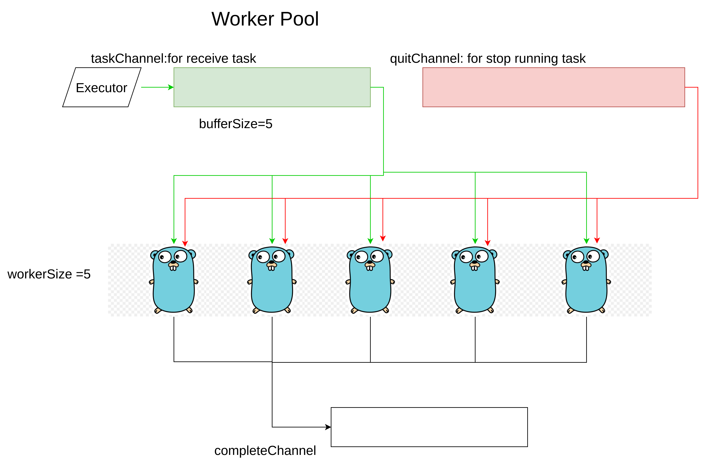

# golang-worker-pool-sample

This repository is for implementation a worker pool with golang

## worker pools concept
use fixed worker to execute multiple task concurrently



```golang
package work

import (
	"context"
	"errors"
	"fmt"
	"sync"
)

type Executor interface {
	Execute() error
	OnError(error)
}
type Pool struct {
	numWorkers    int
	tasks         chan Executor
	start         sync.Once
	stop          sync.Once
	taskCompleted chan bool
	quit          chan struct{}
}

func (p *Pool) TasksCompleted() <-chan bool {
	return p.taskCompleted
}
func NewPool(numWorkers int, taskChannelSize int) (*Pool, error) {
	if numWorkers <= 0 {
		return nil, errors.New("num workers cannot be less, or equal to zero")
	}
	if taskChannelSize < 0 {
		return nil, errors.New("channel size cannot be a negative value")
	}
	return &Pool{
		numWorkers:    numWorkers,
		tasks:         make(chan Executor, taskChannelSize),
		start:         sync.Once{},
		stop:          sync.Once{},
		taskCompleted: make(chan bool),
		quit:          make(chan struct{}),
	}, nil
}
func (p *Pool) Start(ctx context.Context) {
	p.start.Do(func() {
		p.startWorker(ctx)
	})
}
func (p *Pool) Stop() {
	p.stop.Do(func() {
		close(p.quit)
	})
}
func (p *Pool) AddTask(t Executor) {
	select {
	case p.tasks <- t:
	case <-p.quit:
	}
}
func (p *Pool) AddTaskNonBlocking(t Executor) {
	go func() {
		select {
		case p.tasks <- t:
		case <-p.quit:
		}
	}()
}
func (p *Pool) startWorker(ctx context.Context) {
	for i := 0; i < p.numWorkers; i++ {
		go func(workerNum int) {
			fmt.Printf("worker number %d started\n", workerNum)
			for {
				select {
				case <-ctx.Done():
					return
				case <-p.quit:
					return
				case task, ok := <-p.tasks:
					if !ok {
						return
					}
					if err := task.Execute(); err != nil {
						task.OnError(err)
					}
					p.taskCompleted <- true
					fmt.Printf("worker number %d finished a task\n", workerNum)
				}
			}
		}(i)
	}
}

type task struct {
	execute      func() error
	errorHandler func(error)
}

func NewTask(execute func() error, errorHandler func(error)) *task {
	return &task{
		execute:      execute,
		errorHandler: errorHandler,
	}
}

func (t *task) Execute() error {
	return t.execute()
}

func (t *task) OnError(err error) {
	t.errorHandler(err)
}
```
usecase
```golang
package main

import (
	"context"
	"fmt"
	"log"
	"net/http"

	"github.com/leetcode-golang-classroom/golang-worker-pool-sample/internal/work"
)

func main() {
	wp, err := work.NewPool(5, 5)
	if err != nil {
		log.Fatal(err)
	}
	// 設定離開時，先送　context cancel 訊號給 subroutine
	ctx, cancel := context.WithCancel(context.Background())
	defer cancel()

	wp.Start(ctx)
	// 加入 20　個　Task
	for range 20 {
		task := work.NewTask(func() error {
			const urlString = "https://google.com"
			res, err := http.Get(urlString)
			if err != nil {
				return err
			}
			fmt.Printf("%s returned status code %d\n", urlString, res.StatusCode)
			return nil
		}, func(err error) {
			fmt.Println(err)
		})

		// wp.AddTask(task)
		wp.AddTaskNonBlocking(task)
	}
	// 利用　counter 來計算有多少 task 完成
	counter := 0
	for completed := range wp.TasksCompleted() {
		if completed {
			counter++
		}
		// 當 Task 數量等於建立數量，代表所有任務都完成
		if counter == 20 {
			wp.Stop()
			return
		}
	}
}
```
## sample

ref https://gobyexample.com/worker-pools